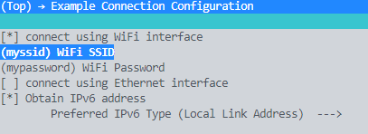
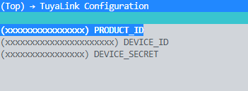

# ESP32-TuyaLink-Relay-CTL

Espressif ESP-IDF version:

- [release/v4.3](https://github.com/espressif/esp-idf/tree/release/v4.3)

## Configure the project

```cpp
idf.py menuconfig
```

```cpp
//Example Connection Configuration:
Set WiFi SSID
Set WiFi Password
```


```cpp
//TuyaLink Configuration:
set PRODUCT_ID
set DEVICE_ID
set DEVICE_SECRET
```


## Reference

- [0x1abin - tuya_iot_link_sdk_for_esp32](https://github.com/0x1abin/tuya_iot_link_sdk_for_esp32)

